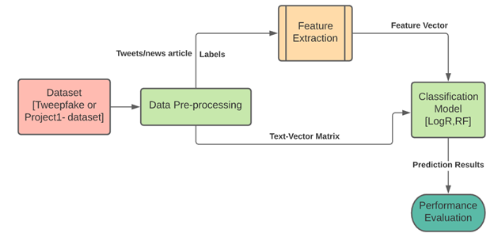

# Understanding Machine vs Human Generated Text in News
## Introduction
The average consumption of news from non-traditional sources such as social media, blogs and instant communications groups has received much attention in the last few years. Social media is one of the key sources of news information on which people today rely. There are a variety of problems associated with the release of a new data source. In 2016, considerable attention was devoted to the prominence of misinformation within America's political discourse, particularly following President Trump's elections. The word "false news" was widely used to describe factually inaccurate and misleading articles often published for money purposes through page reviews. Moreover, the issue of legitimacy is difficult: what 'legitimizes' a news site? Can this be determined in an objective way? The generation of fake texts and tweets is deliberate, based on unknown sources, which are trivial and current methodologies in which consumer trustworthiness, truthfulness of news and social media participation are individually validated. In this project, we are trying to produce a model that can predict the likelihood of a fake tweet which might have been written by a machine in a given set of tweets while also validating the same on news articles scraped from the internet.</br>

## Problem Description
The problem statement of this research revolves around extracting statistical measures from the language distribution of large language models and incorporating them to build a classification model that classifies a given tweet as ‘human’ generated or ‘machine’ generated and maximizing its accuracy by performing hyper tuning on the parameters selected to build the detector model. The necessity of the system is to truncate the rapid dissemination of the falsified information that pose a threat to social media as a platform. In this project, we strive to utilize social media to classify the news content, particularly Twitter. The aim of the project is to explore and advocate on the selection of determinant statistical features that help detect/classify a news as either ‘human’ or ‘machine’ generated.</br>

## Model Description
The implementation involves tasks such as data preprocessing, feature extraction, training classification models etc. The architecture diagram of the implementation is provided below.<br><br>
</br>

## Test Datasets
1.	**[TweepFake Dataset](data)** </br>
The primary dataset we used for the project was the provided TweepFake dataset which is a twitter deep fake dataset which is a collection of human and deep-fake messages. It contains a variety of different columns but the only columns that we were considering in this project were:
-	Tweet text
-	Category of the tweet (human/ machine)
This dataset contained a total of 20926 equally categorized tweets in the training dataset and 2584 tweets in the test dataset.</br>

2.	**[Custom Dataset](customdata)**<br>
The other dataset that we used was a custom dataset that we created. It was a combination of news articles by humans scraped from various news websites and machine generated news articles which were made using HuggingFace and DeepAI. This dataset was modified for it to only contain two columns:
-	News text
-	Category of the news (human/machine)
This dataset contained a total of 198 equally categorized news articles in the training dataset and 49 news articles in the test dataset.</br>

## Command Line
### DISCLAIMER
- The program uses a [glove.txt](https://www.kaggle.com/watts2/glove6b50dtxt) file which is a necessity for the execution of the program.

```
python classifier.py
```

## Results
- For the TweepFake dataset, <b>78% accuracy</b> was achieved by using the <b>bag of words</b> features into the <b>logistic regression classifier</b>. 
- For the Custom Dataset, <b>100% accuracy</b> was achieved by using the <b>n-grams categorization</b> algorithm into the <b>random forest classifier</b> which might be due to <b>overfitting</b>.</br>
 